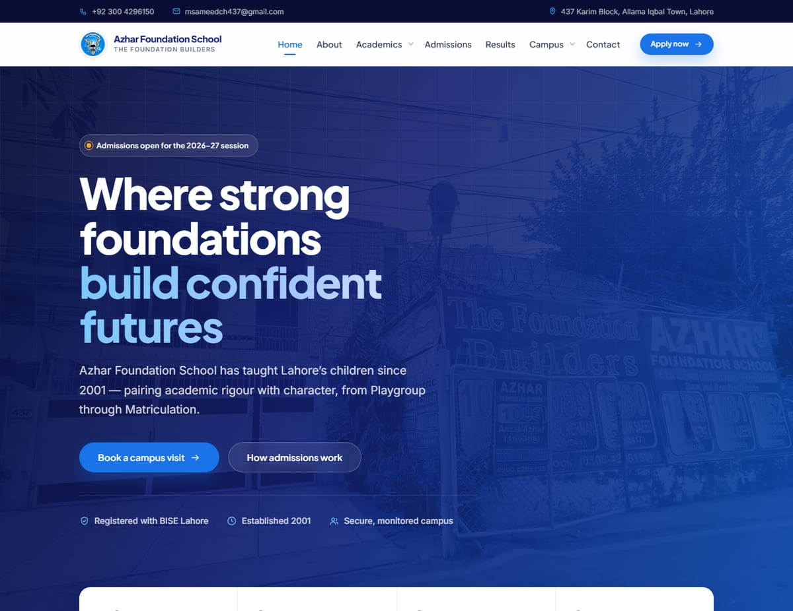
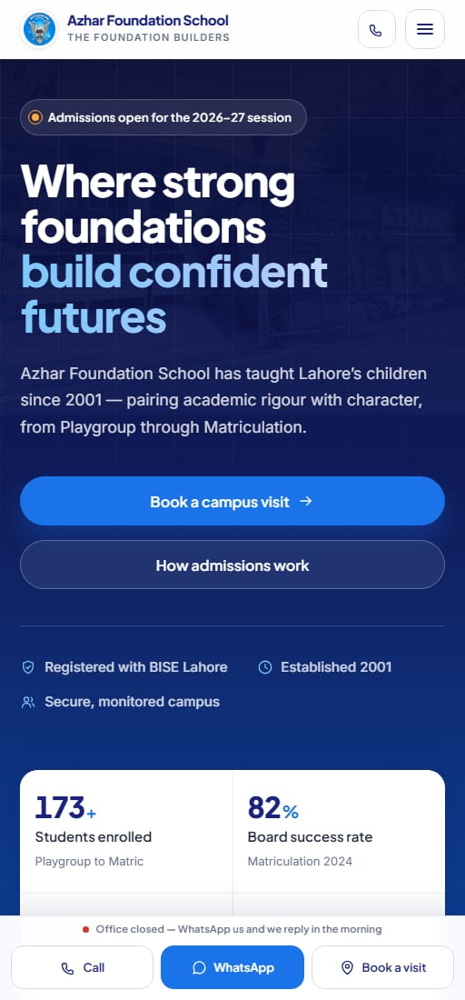

<div align="center">


# Azhar Foundation School

**The Foundation Builders — Playgroup to Matriculation, Lahore, since 2001**

Marketing and information site for Azhar Foundation School, Allama Iqbal Town.

[**Live site**](https://azhar-foundation-school.vercel.app/) · [Report an issue](https://github.com/Sameed437/azhar-foundation-site/issues)


</div>

---

## Preview

| Desktop | Mobile |
| :---: | :---: |
|  |  |

---

## Highlights

- **12 pages, one design system.** Every colour, size, shadow and easing comes from CSS custom properties in a single tokens file — change a token, the whole site follows.
- **Brand-true.** The palette is the school's own: navy `#1a237e`, action blue `#1a73e8`, deep blue `#0d47a1`, gold `#ff9800`, plus the sky blue of the crest.
- **Phone-first conversion.** A fixed mobile bar (Call · WhatsApp · Book a visit) that knows the office hours, a WhatsApp-first enquiry form with Pakistani mobile validation, and honest status messaging that never fakes success.
- **Signature details.** Duotone hero treatment, a three-stroke "foundation courses" mark on every section eyebrow, the crest as a watermark in dark panels, closing CTA panels that straddle the footer seam.
- **Accessible.** WCAG AA contrast throughout, focus traps on modals and the drawer, keyboard-operable carousel and lightbox, full `prefers-reduced-motion` coverage, skip link, live regions.
- **Fast.** ~103 kB JS / ~17 kB CSS gzipped, optimized images (15.6 MB → 1.8 MB), WebP hero variants, no CSS framework, no animation libraries.

---

## Quick start

```bash
npm install
npm start          # dev server on http://localhost:3000
```

> **Windows PowerShell note:** if `npm` is blocked by the execution policy, use
> `npm.cmd start` or run `Set-ExecutionPolicy -Scope CurrentUser RemoteSigned` once.

| Script | What it does |
| --- | --- |
| `npm start` | Development server with hot reload |
| `npm test` | Jest + Testing Library suite |
| `npm run build` | Production bundle in `build/` |
| `npm run optimize:images` | Downscale/recompress everything in `public/images` |
| `npm run generate:icons` | Rebuild the favicon set from the crest |
| `npm run generate:og` | Rebuild the social share card + hero WebP variants |

---

## Pages

| Route | Page | Notes |
| --- | --- | --- |
| `/` | Home | Duotone hero, stat bar, toppers, programmes, gallery |
| `/about` | About | Story, mission, values, stages, milestone timeline |
| `/academics` | Academics | Teaching approach, curriculum by stage, assessment, calendar |
| `/faculty` | Faculty | Leadership ledger and departments — listed by role, no invented names |
| `/admissions` | Admissions | 4-step process, entry points, documents, fees, FAQ |
| `/results` | Results | Five-year board record, toppers, grade spread, placements |
| `/facilities` | Facilities | Learning spaces, safety checklist, location + map |
| `/gallery` | Gallery | Editorial photo mosaic with keyboard-accessible lightbox |
| `/news` | News & Events | Announcements and the events calendar |
| `/contact` | Contact | WhatsApp-first enquiry form, contact cards, map |
| `/login` | Portal login | UI only — accounts are issued by the office |
| `/admin` | **Fee Management System** | Staff-only panel — see below |
| `*` | 404 | Links to every page |

The header groups these into seven items; **Academics** and **Campus** are dropdowns
on desktop and expandable groups in the mobile drawer.

---

## Fee Management System (`/admin`)

A complete replacement for the manual Excel + Word-mail-merge fee workflow,
lazy-loaded so it adds nothing to the public site's bundle:

- **Dashboard** — expected / received / outstanding / concessions for any month,
  a collection chart across the session, family payment status, largest balances.
- **Students & Families** — family accounts exactly like the fee register
  (siblings share an ID and a challan), with concessions, joining/leaving months,
  opening arrears, search, and a paste-importer for the old Excel rows.
- **Fee Sheet** — the monthly register: type what each family paid; arrears roll
  forward automatically; one-click "mark fully paid".
- **Challans** — one click prints challans for every family with a balance (or
  all, or one): Student Copy + Office Copy per A4 page, due/validity dates and
  the fine note, matching the old Word template.
- **Settings** — session year, challan dates and wording, JSON backup/restore.

**Storage has two modes.** Out of the box it runs in *device mode* (data in that
browser's localStorage, protected by a passcode — download backups from
Settings!). To get real logins, cloud storage and multi-device access, create a
free Supabase project, run [`supabase/schema.sql`](supabase/schema.sql) in its
SQL editor, add staff users under Authentication, and set the two env vars from
[`.env.example`](.env.example) in Vercel — the panel switches over on the next
deploy, and a backup file moves your data across. All tables are locked behind
row-level security; the fee engine itself is covered by unit tests
(`src/admin/data/calc.test.js`).

---

## Project structure

```
src/
├── admin/                    ← fee management system (own lazy chunk)
│   ├── AdminApp.js  AdminContext.js  admin.css
│   ├── data/         calc.js (fee engine + tests), store, local & supabase drivers
│   └── pages/        Dashboard, Families, FeeSheet, Challans, Settings, Login
├── data/site.js              ← ALL content: school details, nav, copy, results, events
├── styles/
│   ├── tokens.css            design tokens (colour ramps, type scale, spacing, motion)
│   └── base.css              reset + shared primitives (.section, .btn, .card,
│                             .eyebrow, .cta-panel, .media-graded, .crest-mark, .reveal)
├── components/
│   ├── Header.js             sticky header, dropdowns, mobile drawer (focus-trapped)
│   ├── Footer.js             link columns + contact
│   ├── PageHero.js           CSS-art interior mastheads (tone + variant props)
│   ├── ActionBar.js          mobile Call/WhatsApp/Visit bar with office-hours logic
│   ├── Gallery.js            carousel (autoplay, swipe, keyboard, portrait letterboxing)
│   ├── TopperGrid.js         board position-holder cards
│   ├── Reveal.js             IntersectionObserver scroll reveals (keyframe-based)
│   ├── Icon.js               inline SVG icon set
│   ├── ScrollToTop.js        route scroll reset + back-to-top
│   └── Login.js              portal sign-in UI
├── pages/                    one .js + .css per route
scripts/
├── optimize-images.mjs       image pipeline (sharp)
├── generate-icons.mjs        favicon.ico + PWA icons from the crest
└── generate-og.mjs           1200×630 share card + hero WebP
```

### Editing content

Everything a school administrator would want to change lives in
[`src/data/site.js`](src/data/site.js): phone numbers, office hours, programmes,
board results, news posts, event dates, gallery captions. Edit it there and every
page, the footer and the structured data update together. After adding photos to
`public/images`, run `npm run optimize:images`.

---

## Design system

- **Typography** — Plus Jakarta Sans (display) + Inter (body), on a fluid `clamp()`
  scale with tokenised tracking and line heights.
- **Colour** — brand ramps plus navy-tinted neutrals and navy-tinted shadows, with
  semantic tokens (`--accent-text`, `--danger-*`, `--success-*`) tuned for WCAG AA.
- **Surfaces** — four section levels (default / sunken / elevated / dark); dark
  sections carry a built-in glow and blueprint grid.
- **Motion** — keyframe reveals gated on `html.js` (crawlers and no-JS users get full
  content), hero load choreography, and a global reduced-motion kill-switch.

---

## Before going live — checklist

These items ship as clearly-marked placeholders and need real data from the school:

- [ ] **Statistics & results history** in `site.js` (five-year table, grade spread,
      placements are plausible templates — confirm with the office; the 2024
      toppers came from the school's previous site)
- [ ] **News posts and event dates** (placeholder notices)
- [ ] **Testimonials** — the `testimonials` array is intentionally empty; the band
      renders nothing until real parent quotes are supplied
- [ ] **Social profile URLs** in `Footer.js` (currently platform homepages)
- [ ] **Contact form backend** — currently composes a WhatsApp/email message
      client-side (works well for this audience, but a form endpoint can be added)
- [ ] **Portal login** — UI only; wire real authentication before promoting it

---

## Testing

```bash
npm test
```

`react-router-dom` v7 ships an `exports`-only entry that CRA 5's Jest cannot
resolve; the `jest.moduleNameMapper` block in `package.json` bridges it, and
`src/setupTests.js` polyfills the browser APIs jsdom lacks (`TextEncoder`,
`matchMedia`, `scrollTo`, `IntersectionObserver`).

---

<div align="center">
<sub>Built with plain CSS and care · © Azhar Foundation School, Lahore</sub>
</div>
